# KnowFoot

Aplicativo usando [Qt para Python em plataforma Android](https://www.qt.io/blog/taking-qt-for-python-to-android).

## Funcionalidades

### Cadastro de paciente

### Buscar paciente

### Teste

Medição de 6 parâmetros em escala de 5 níveis (-2, -1, 0, 1, 2).
Os parâmetros são:

* Curvaturas acima e abaixo do maléolo lateral

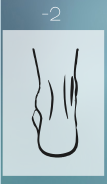

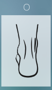
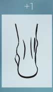
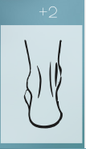

* Posição do calcâneo

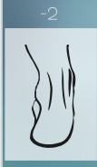
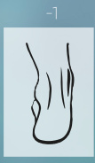
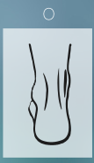
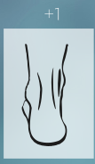

* Abdução e Adução do antepé sobre o retropé

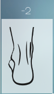
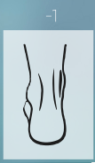
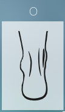
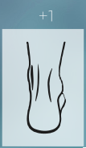
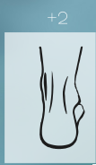

* Altura do arco longitudinal medial

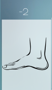
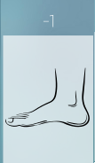
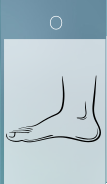
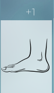
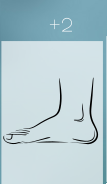

* Proeminência na região da articulação talonavicular (ATN)

 -2")
 -1")
 0")
 1")
 2")

* Palpação da cabeça do tálus

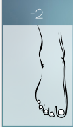
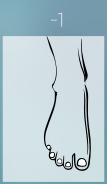
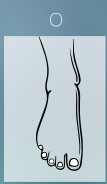
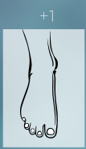
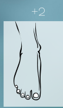
